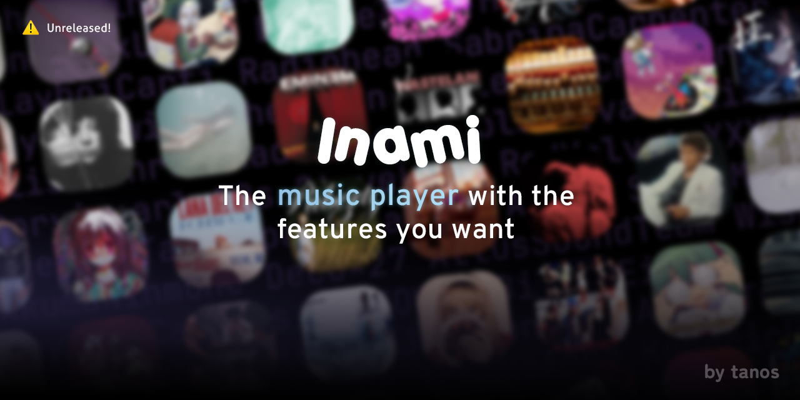

# Inami

🚧 **Work in Progress**, in very early stage right now; everything is prone to change.

_The **one and only** proper music player, with all the features you need._

[📖 Documentation](#) • [💡 Request Feature](https://github.com/tanosshi/Inami/issues)

## How Inami will stand out from others

- Everything is customizable, from every aspect of the app including the app logo. If you do not want something, toggle it off.
- Run fully offline, hybrid synced or fully online. It all depends on your likings.
- Offline music recommendation, based off of your listening habits.
- yt-dlp fully integrated, with fallback support.
- Last.fm integration, your stats are always yours.
- Locally track listening habits, only for you, fully private.
- Automatically fetch album covers and lyrics if toggled.
- All your data is yours, stored locally on your device or optionally synced.
- Free and open source and always will be.

## How other players compare

- Most players are built in Kotlin, while we run in Expo.js. Performance may vary.
- Battery usage might be slightly higher than the average music player.
- Storage wise, we'll be around 3 times larger than the average music players as we'll try to keep you online, even if you're offline.

---

## 🎯 Feature Roadmap

| Feature                                             | Importance                        | Completion                 |
| --------------------------------------------------- | --------------------------------- | -------------------------- |
| Auto fetch metadata; artist, covers, lyrics etc.    | 🔴 **Important**                  | 🗯 **Improvement required** |
| Navigation bar on top (Take auxio as reference)     | 🔴 **Important**                  | 🔄 **Planned**             |
| Download music. MP3 with yt-dlp, FLAC considerable. | 🔴 **Important**                  | 🔄 **Planned**             |
| Sync playlists to Spotify / YouTube music (etc.)    | 🔴 **Important**                  | 🔄 **Planned**             |
| Tag cloud feature (In profile)                      | 🔴 **Important**                  | 🔄 **Planned**             |
| Custom logo and app name                            | 🟡 **High**                       | 🔄 **Planned**             |
| Music recommendations, offline version after        | 🟡 **High**                       | 🔄 **Planned**             |
| Tiktok-like scroll feed for offline music recs      | 🟡 **High**                       | 🔄 **Planned**             |
| Gapless playback                                    | 🟡 **High**                       | 🔄 **Planned**             |
| (Custom) Widgets (1x5, 2x2, etc)                    | 🟡 **High**                       | 🔄 **Planned**             |
| Music energy score of the day / Mainstream score    | 🟡 **High**                       | 🔄 **Planned**             |
| Control music from PC/web                           | 🟡 **High**                       | ✅ **Implemented**         |
| Artist fan image board                              | 🟡 **High**                       | 🔄 **Planned**             |
| Automatic word for word lyrics (waveform predict)   | 🟡 **High**                       | 🔄 **Planned**             |
| Volume normalizing                                  | 🟡 **High**                       | 🔄 **Planned**             |
| Smart playlists                                     | 🟢 **Low**                        | 🔄 **Planned**             |
| Integration with Last.fm                            | 🟢 **Low**                        | 🟡 **Ongoing**             |
| View local most played artist/track                 | 🟢 **Low**                        | 🔄 **Planned**             |
| Sync data, songs and playlists                      | 🟢 **Low**                        | 🔄 **Planned**             |
| Automatic music recommender (Bored detector)        | 🟢 **Low**                        | 🔄 **Planned**             |
| Automatic sleep timer                               | 🟢 **Low**                        | 🔄 **Planned**             |
| Floating lyrics                                     | 🟢 **Low**                        | 🔄 **Planned**             |
| Soundcloud-like comments                            | 🟢 **Low**                        | 🔄 **Planned**             |
| Copy music link; even when offline.                 | 🟢 **Low**                        | 🔄 **Planned**             |
| Squiggly line in notification (if possible)         | 🟢 **Low**                        | 🔄 **Planned**             |
| Show last.fm stats in For You                       | 🟢 **Low**                        | 🔄 **Planned**             |
| Discord Rich Presence (Battery consuming)           | 🟢 **Low** ⁉ **Success-rate low** | 🔄 **Attempt queued**      |
| Airbuds™ (app) support (Challenging)                | ⁉ **Scrap?**                      | Deciding                   |
| In-app equalizer                                    | ⁉ **Scrap?**                      | Deciding                   |
| Modify animation curves per element (Advanced)      | ⁉ **Scrap?**                      | Deciding                   |
| Directly output to DAC                              | ⁉ **Scrap?**                      | Deciding                   |

#### '⁉' indicates that i'll think about it after core functions are done.

> It is most likely that Inami will weigh more than 1GB after install with all the features implemented, enabled and **cached** in app.

## 

## 🎯 (Future) Theme Roadmap

| Feature               | Importance       |
| --------------------- | ---------------- |
| Regular dark mode     | 🔴 **Fix**       |
| YouTube Music replica | 🔴 **Ongoing**   |
| Playful pink          | 🔴 **Important** |
| Spotify replica       | 🟡 **High**      |
| Sharp dark mode       | 🟡 **High**      |

> These are presets, user's can make their own or customize existing ones.
> Themes will include custom fonts, colors, icons and more.

---

Inspired by [auxio](https://github.com/OxygenCobalt/Auxio) and [Metro](https://github.com/MuntashirAkon/Metro) (Originally RetroMusicPlayer). And light inspiration from [Pano Scrobbler](https://github.com/kawaiiDango/pano-scrobbler).

## 🗂️ License

Inami is released under the GNU General Public License v3.0
(GPLv3), which can be found [here](LICENSE)

> I am not associated with anything you do in this app.
