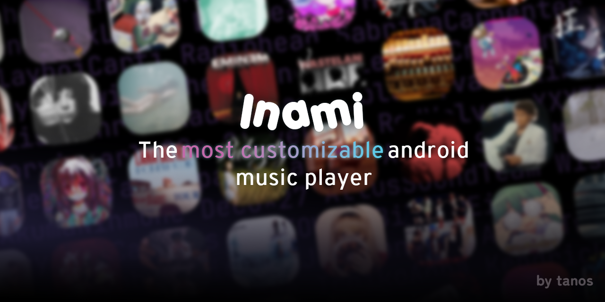

# Myoraei

_This file was made incase the structure wasn't clear, or gets confusing._

_(Last updated: 29-12-2025)_

## Structure

### Root folders

| Folder        | Purpose                 |
| ------------- | ----------------------- |
| `app\`        | Core app files          |
| `assets\`     | Images                  |
| `components\` | Main files for app\     |
| `constants\`  | Set variables, settings |
| `contexts\`   | Loads context providers |
| `hooks\`      | Dynamic (theme) hooks   |
| `store\`      | States, stores          |
| `utils\`      | Database, helpers       |

###

| Folder                     | Purpose                |
| -------------------------- | ---------------------- |
| `app\(tabs)`               | Tabs for main screens  |
| `app\playlist`             | Playlist screens       |
| `app\settings`             | Settings screens       |
| `components/home`          | Home screen blocks     |
| `components/landing`       | Landing pages          |
| `components/player`        | Player screen blocks   |
| `components/playlists`     | Playlist modals        |
| `components/songs`         | Songs modals           |
| `constants/customizations` | Customization settings |
| `constants/customs`        | Feature settings       |
| `constants/themes`         | Defined themes         |

## How was AI used in this project, and should I be concerned?

AI was primarily used to help creating databases, the zustand stores and making the animations for the actions.
